# Data Processing Tools

This folder contains Python tools for processing and analyzing the OpenVRDrive VR driving simulation dataset. These tools handle the conversion, integration, and aggregation of experimental data from multiple sources.

## Overview

The data processing pipeline transforms raw experimental data into a unified, analysis-ready format:

```
Raw Data                    Intermediate               Final Output
┌─────────────────┐        ┌─────────────────┐        ┌─────────────────┐
│ .log (CARLA)    │───────▶│ .txt (parsed)   │───────▶│                 │
└─────────────────┘        └─────────────────┘        │                 │
                                                       │  Integrated     │
┌─────────────────┐        ┌─────────────────┐        │  JSON Dataset   │
│ VR data (.json) │───────▶│ Aligned data    │───────▶│                 │
└─────────────────┘        └─────────────────┘        │                 │
                                                       └─────────────────┘
┌─────────────────┐
│ Trajectory data │────────────────────────────────────────────┘
└─────────────────┘
```

## Requirements

### Python Dependencies

```bash
pip install numpy pandas matplotlib
```

### External Dependencies

- **CARLA Python API**: Required for log file conversion
- **DreyeVR**: VR data parsing utilities (included in `src/`)

## File Structure

```
data_processing_tools/
├── README.md                    # This documentation
│
├── config_loader.py             # Centralized configuration loader
│                                 # Supports multi-scenario extensibility
│
├── log2txt.py                   # Convert CARLA .log to .txt format
├── convert.py                   # Full data conversion pipeline
├── example.py                   # Standalone VR data visualization
│
├── single_exp_data_intergrate.py   # Integrate single trial data
├── single_person_data_intergrate.py # Process all trials for one participant
├── all_person_data_intergrate.py    # Process all participants
├── intergrate_all.py               # Aggregate into final dataset
│
├── src/                         # Core parsing and visualization modules
│   ├── __init__.py
│   ├── parser.py               # VR recording data parser
│   ├── utils.py                # Utility functions
│   └── visualizer.py           # Plotting functions
│
├── images/                      # Documentation images (auto-generated)
├── cache/                       # Cached parsed data (auto-generated)
└── results/                     # Output visualizations (auto-generated)
```

## Quick Start

### 1. Configure Your Environment

First, ensure you have the correct Python environment and dependencies:

```bash
cd data_processing_tools
pip install -r requirements.txt  # If requirements.txt exists
```

### 2. Test Configuration Loading

Verify the configuration system is working:

```bash
python config_loader.py
```

Expected output:
```
Testing config_loader module...

Available scenarios: ['scenario1-HDV cuts into a CAV Platoon']
Loaded config from: .../scenario1_trial_params.json
Scenario name: HDV Cuts into a CAV Platoon
Scenario ID: 1

Constants: Constants(scenario='HDV Cuts into a CAV Platoon', dlc_scenarios=14, mlc_scenarios=8)
```

### 3. Process Data

See detailed usage for each tool below.

---

## Complete Workflow Example

This section provides end-to-end examples for processing experimental data.

### Example 1: Process a Single Trial

Process one experimental trial from raw data to integrated output:

```python
from single_exp_data_intergrate import SingleExpDataIntergrate

# Define file paths
trajectory_file = 'data/participant_00/discretionary_[72, 0.6, 64.8, 7]_trajectory.json'
vr_data_file = 'data/participant_00/discretionary_[72, 0.6, 64.8, 7]_vr.json'

# Create integrator instance
integrator = SingleExpDataIntergrate(
    traj_data_path=trajectory_file,
    vr_data_path=vr_data_file
)

# Run integration
result = integrator.run()

# Access integrated data
print(f"Experiment type: {result['exp_info']['type']}")
print(f"VR vehicle ID: {result['vr_id']}")
print(f"Number of vehicles: {len(result['all_veh_info'])}")

# Access VR vehicle data
vr_vehicle = result['all_veh_info'][result['vr_id']]
print(f"Timestamps: {len(vr_vehicle['carla_ts'])} frames")
print(f"Has eye tracking: {'LEFTPupilDiameter' in vr_vehicle}")
print(f"Has user inputs: {'Throttle' in vr_vehicle}")
```

### Example 2: Process All Trials for One Participant

```python
from single_person_data_intergrate import SinglePersonDataIntegrate
import os

# Define paths
participant_id = '00'
raw_data_dir = f'raw_data/{participant_id}'
output_dir = 'processed_data'

# Initialize processor
processor = SinglePersonDataIntegrate(
    person_dir=raw_data_dir,
    folder_dir=output_dir
)

# Process all trials for this participant
processor.find_all_exp_data()

# Results are saved to:
# - processed_data/00/traj_data/*.json (integrated data)
# - processed_data/00/plot_result/*/ (visualizations)
# - processed_data/00/vr_result/*/ (parsed VR data)

print(f"Processing complete for participant {participant_id}")
print(f"Output directory: {output_dir}/{participant_id}")
```

### Example 3: Batch Process All Participants

```python
from pathlib import Path
from single_person_data_intergrate import SinglePersonDataIntegrate

# Configuration
raw_data_root = Path('raw_data')
output_root = Path('processed_data')

# Get all participant directories
participant_dirs = sorted([d for d in raw_data_root.iterdir() if d.is_dir()])

print(f"Found {len(participant_dirs)} participants to process")

# Process each participant
for participant_dir in participant_dirs:
    participant_id = participant_dir.name
    print(f"\nProcessing participant {participant_id}...")
    
    try:
        processor = SinglePersonDataIntegrate(
            person_dir=str(participant_dir),
            folder_dir=str(output_root)
        )
        processor.find_all_exp_data()
        print(f"✓ Completed {participant_id}")
    except Exception as e:
        print(f"✗ Error processing {participant_id}: {e}")
        continue

print("\nBatch processing complete!")
```

### Example 4: Aggregate All Data

```python
from intergrate_all import IntegrateAll
from config_loader import load_scenario_config, Constants

# Load scenario configuration
config = load_scenario_config()
constants = Constants(config)

# Initialize aggregator
aggregator = IntegrateAll(
    data_dir='processed_data',
    constants=constants
)

# Aggregate all processed data
final_dataset = aggregator.integrate_all_data()

# Save to file
import json
with open('final_dataset.json', 'w') as f:
    json.dump(final_dataset, f, indent=2)

print(f"Dataset aggregation complete!")
print(f"Discretionary scenarios: {len(final_dataset['discretionary'])}")
print(f"Mandatory scenarios: {len(final_dataset['mandatory'])}")

# Access specific trial
participant_id = '00'
scenario_idx = 0
if scenario_idx in final_dataset['discretionary']:
    if participant_id in final_dataset['discretionary'][scenario_idx]:
        trial_data = final_dataset['discretionary'][scenario_idx][participant_id]
        print(f"\nParticipant {participant_id}, Scenario {scenario_idx}:")
        print(f"  VR vehicle: {trial_data['vr_id']}")
        print(f"  Vehicles in scene: {len(trial_data['all_veh_info'])}")
```

### Example 5: Complete Pipeline Script

Full pipeline from log conversion to final dataset:

```python
#!/usr/bin/env python3
"""
Complete data processing pipeline for OpenVRDrive dataset.
Usage: python process_complete_pipeline.py --raw-dir /path/to/raw --output-dir /path/to/output
"""
import argparse
from pathlib import Path
import subprocess
from single_person_data_intergrate import SinglePersonDataIntegrate
from config_loader import load_scenario_config, Constants
import json

def step1_convert_logs(raw_dir):
    """Convert CARLA .log files to .txt"""
    print("Step 1: Converting CARLA logs to text...")
    # Run log2txt.py
    subprocess.run(['python', 'log2txt.py', '--data-dir', str(raw_dir)], check=True)
    print("✓ Log conversion complete\n")

def step2_process_participants(raw_dir, output_dir):
    """Process all participant data"""
    print("Step 2: Processing participant data...")
    
    participant_dirs = sorted([d for d in raw_dir.iterdir() if d.is_dir()])
    print(f"Found {len(participant_dirs)} participants\n")
    
    for i, participant_dir in enumerate(participant_dirs, 1):
        participant_id = participant_dir.name
        print(f"[{i}/{len(participant_dirs)}] Processing {participant_id}...")
        
        try:
            processor = SinglePersonDataIntegrate(
                person_dir=str(participant_dir),
                folder_dir=str(output_dir)
            )
            processor.find_all_exp_data()
            print(f"✓ Completed {participant_id}\n")
        except Exception as e:
            print(f"✗ Error: {e}\n")
            continue
    
    print("✓ All participants processed\n")

def step3_aggregate_data(output_dir):
    """Aggregate into final dataset"""
    print("Step 3: Aggregating final dataset...")
    
    # Load configuration
    config = load_scenario_config()
    constants = Constants(config)
    
    # Run aggregation
    from intergrate_all import IntegrateAll
    aggregator = IntegrateAll(data_dir=str(output_dir), constants=constants)
    final_dataset = aggregator.integrate_all_data()
    
    # Save
    output_file = output_dir / 'final_dataset.json'
    with open(output_file, 'w') as f:
        json.dump(final_dataset, f, indent=2)
    
    print(f"✓ Dataset saved to {output_file}\n")
    return final_dataset

def main():
    parser = argparse.ArgumentParser(description='Complete OpenVRDrive data processing pipeline')
    parser.add_argument('--raw-dir', type=str, required=True, help='Raw data directory')
    parser.add_argument('--output-dir', type=str, required=True, help='Output directory')
    parser.add_argument('--skip-log-conversion', action='store_true', 
                        help='Skip log conversion (if already done)')
    parser.add_argument('--skip-processing', action='store_true',
                        help='Skip participant processing (if already done)')
    
    args = parser.parse_args()
    
    raw_dir = Path(args.raw_dir)
    output_dir = Path(args.output_dir)
    output_dir.mkdir(parents=True, exist_ok=True)
    
    print("="*60)
    print("OpenVRDrive Data Processing Pipeline")
    print("="*60 + "\n")
    
    # Execute pipeline
    if not args.skip_log_conversion:
        step1_convert_logs(raw_dir)
    else:
        print("Skipping Step 1: Log conversion\n")
    
    if not args.skip_processing:
        step2_process_participants(raw_dir, output_dir)
    else:
        print("Skipping Step 2: Participant processing\n")
    
    final_dataset = step3_aggregate_data(output_dir)
    
    # Summary
    print("="*60)
    print("Pipeline Complete!")
    print("="*60)
    print(f"Discretionary scenarios: {len(final_dataset['discretionary'])}")
    print(f"Mandatory scenarios: {len(final_dataset['mandatory'])}")
    print(f"Output location: {output_dir}")

if __name__ == '__main__':
    main()
```

**Run the complete pipeline**:
```bash
python process_complete_pipeline.py \
    --raw-dir /path/to/raw/data \
    --output-dir /path/to/processed/data
```

### Example 6: Analyze Processed Data

```python
import json
import numpy as np

# Load final dataset
with open('final_dataset.json', 'r') as f:
    dataset = json.load(f)

# Analyze discretionary lane changes
print("Discretionary Lane Change Analysis")
print("-" * 50)

for scenario_idx, scenario_data in dataset['discretionary'].items():
    participant_count = len(scenario_data)
    print(f"\nScenario {scenario_idx}: {participant_count} participants")
    
    # Collect statistics across participants
    lane_change_times = []
    
    for participant_id, trial_data in scenario_data.items():
        vr_id = trial_data['vr_id']
        vr_vehicle = trial_data['all_veh_info'][vr_id]
        
        # Example: analyze lane change timing
        y_positions = np.array(vr_vehicle['location'])[:, 1]  # Y coordinate
        
        # Simple lane change detection (example)
        if np.max(y_positions) - np.min(y_positions) > 3.5:  # Lane width
            lane_change_frame = np.argmax(np.abs(np.diff(y_positions)))
            timestamps = np.array(vr_vehicle['carla_ts'])
            lc_time = timestamps[lane_change_frame]
            lane_change_times.append(lc_time)
    
    if lane_change_times:
        print(f"  Mean LC time: {np.mean(lane_change_times):.2f}s")
        print(f"  Std LC time: {np.std(lane_change_times):.2f}s")

# Analyze eye tracking data
print("\n\nEye Tracking Data Availability")
print("-" * 50)

total_trials = 0
trials_with_eye_tracking = 0

for exp_type in ['discretionary', 'mandatory']:
    for scenario_idx, scenario_data in dataset[exp_type].items():
        for participant_id, trial_data in scenario_data.items():
            total_trials += 1
            vr_id = trial_data['vr_id']
            vr_vehicle = trial_data['all_veh_info'][vr_id]
            
            if 'LEFTPupilDiameter' in vr_vehicle and 'RIGHTPupilDiameter' in vr_vehicle:
                trials_with_eye_tracking += 1

print(f"Total trials: {total_trials}")
print(f"Trials with eye tracking: {trials_with_eye_tracking}")
print(f"Coverage: {trials_with_eye_tracking/total_trials*100:.1f}%")
```

---

## Tool Documentation

### config_loader.py

**Purpose**: Centralized configuration management for multi-scenario support.

**Key Features**:
- Automatic scenario detection
- Cross-platform path handling
- Easy extensibility for new scenarios

**Usage**:

```python
from config_loader import load_scenario_config, Constants

# Load default scenario (scenario 1)
config = load_scenario_config()
constants = Constants(config)

# Load specific scenario
config = load_scenario_config(scenario_name="scenario2-Highway Merge")

# Access parameters
print(constants.discretionary_params)  # DLC parameter combinations
print(constants.mandatory_params)      # MLC parameter combinations
print(constants.get_param_names('discretionary'))  # Parameter names
```

**Adding New Scenarios**:

1. Create a new scenario folder: `scenario2-Your Scenario Name/`
2. Add trials_info folder with configuration: `trials_info/scenario2_trial_params.json`
3. The config loader will automatically detect and support the new scenario

---

### log2txt.py

**Purpose**: Convert CARLA binary recorder (.log) files to human-readable text format.

**When to Use**: This is typically the first step when processing raw experimental data.

**Usage**:

```bash
# Process all data in default location
python log2txt.py

# Specify custom data directory
python log2txt.py --data-dir /path/to/raw/data
```

**Input**: 
- Directory structure with participant folders containing .log files

**Output**: 
- .txt files in the same location as input .log files

**Configuration**:
Edit the `CARLA_RECORDER_SCRIPT` variable to point to your CARLA installation:
```python
CARLA_RECORDER_SCRIPT = '/path/to/carla/PythonAPI/examples/show_recorder_file_info.py'
```

---

### convert.py

**Purpose**: Full conversion pipeline - parses VR data, generates visualizations, and integrates trajectory data.

**Usage**:

```bash
python convert.py \
    -f /path/to/log.txt \
    -t /path/to/trajectory.json \
    -o /path/to/output/plots \
    -j /path/to/output.json \
    -v /path/to/vr/output
```

**Arguments**:
| Argument | Description |
|----------|-------------|
| `-f` | Input log file (text format) |
| `-t` | Input trajectory JSON file |
| `-o` | Output directory for plots |
| `-j` | Output path for integrated JSON |
| `-v` | Output directory for VR data |

**Output**:
- Integrated JSON file with aligned trajectory and VR data
- Visualization plots (pupil diameter, gaze direction, vehicle position, etc.)

---

### example.py

**Purpose**: Standalone VR data parsing and visualization for exploration and debugging.

**Usage**:

```bash
python example.py --file /path/to/recording.txt --results-dir ./my_results
```

**Generated Visualizations**:
- Pupil diameter over time (left/right)
- Eye tracking validity
- Gaze direction histograms (yaw, pitch)
- Vehicle position (3D trajectory)
- Vehicle rotation over time

#### Example Output Visualizations

The tools generate various visualization plots for data exploration and quality checking. Below are representative examples from each category:

**Eye Tracking Data**

| Pupil Diameter | Eye Openness | Gaze Heatmap |
|:---:|:---:|:---:|
| 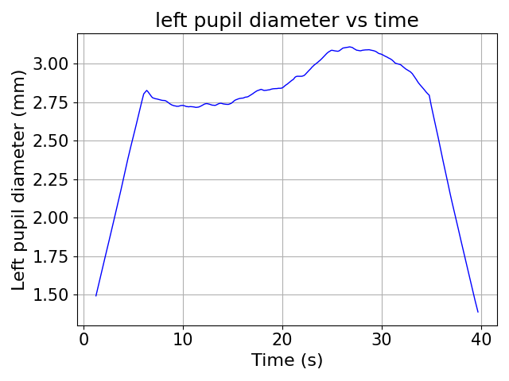 | 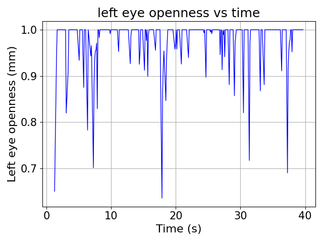 | 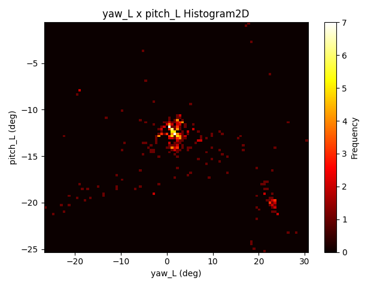 |
| Left pupil diameter over time | Eye openness tracking | Gaze direction distribution |

**Vehicle Dynamics**

| Speed & Acceleration | Position Trajectory | User Inputs |
|:---:|:---:|:---:|
| 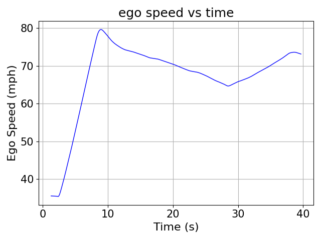 | 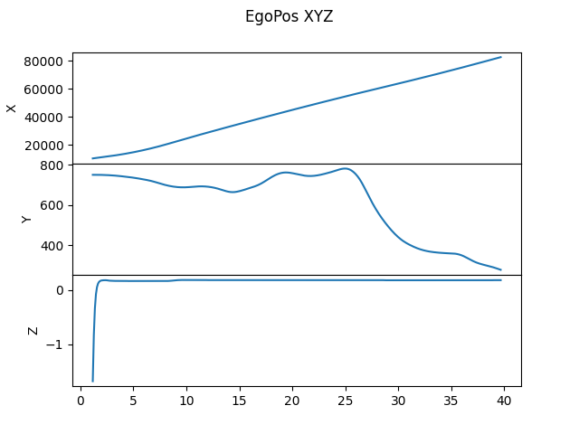 | 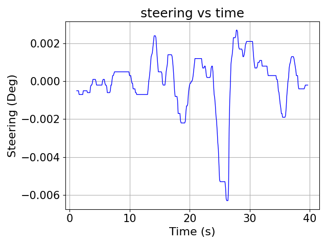 |
| Ego vehicle speed | 3D position over time | Steering angle |

| Throttle | Brake | Velocity Components |
|:---:|:---:|:---:|
| 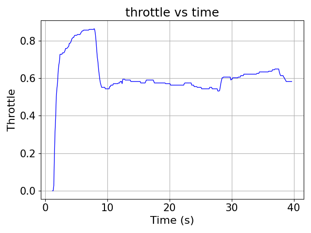 | 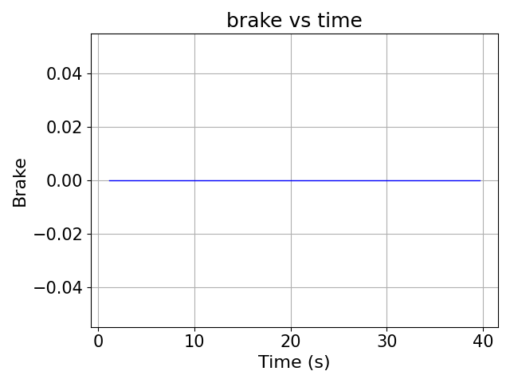 | 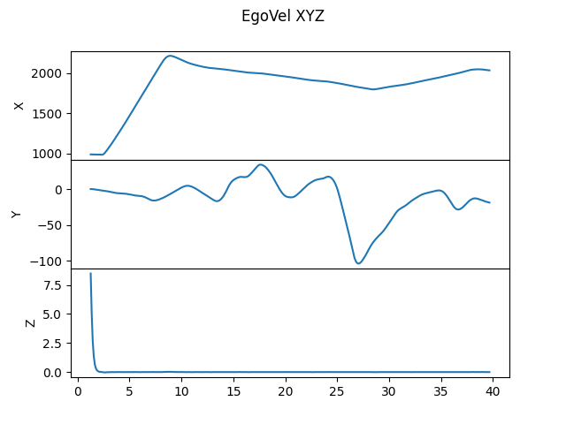 |

**Surrounding Traffic Analysis**

| Relative Distance | Actor Position |
|:---:|:---:|
| 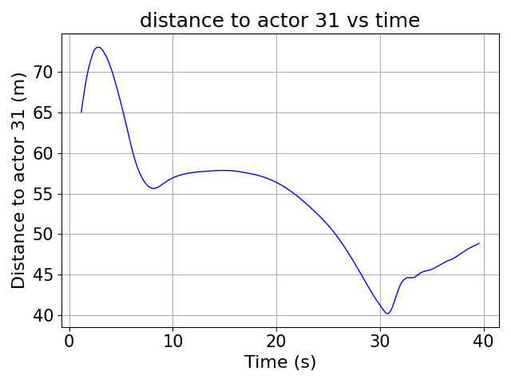 | 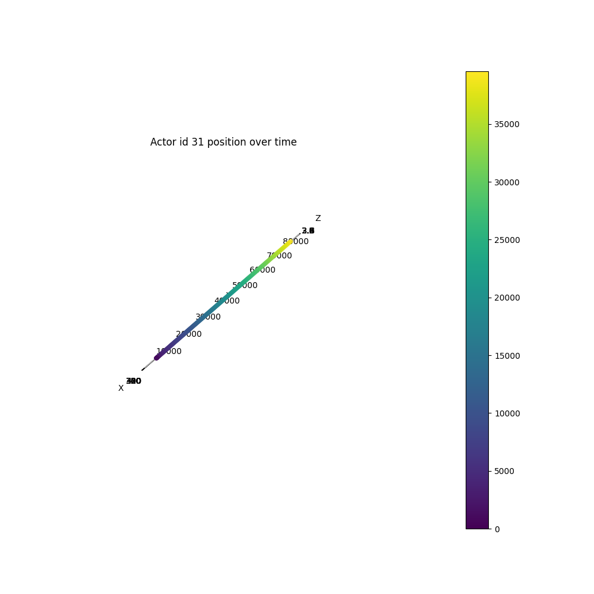 |
| Distance to surrounding vehicle | Surrounding vehicle trajectory |

---

### single_exp_data_intergrate.py

**Purpose**: Integrate VR and trajectory data for a single experimental trial.

**Key Functions**:

1. **Time Alignment**: Synchronizes VR data (higher sample rate) with trajectory data
2. **VR Vehicle Identification**: Finds the human-controlled vehicle in trajectory data
3. **Metadata Extraction**: Parses experiment parameters from file names

**Usage**:

```python
from single_exp_data_intergrate import SingleExpDataIntergrate

# Initialize integrator
integrator = SingleExpDataIntergrate(
    traj_data_path='/path/to/trajectory.json',
    vr_data_path='/path/to/vr_data.json'
)

# Run integration
result = integrator.run()

# Access results
print(result['exp_info'])       # Experiment metadata
print(result['vr_id'])          # VR vehicle ID
print(result['all_veh_info'])   # All vehicle trajectories with VR data
```

**Output Structure**:
```python
{
    'exp_info': {
        'type': 'discretionary',           # or 'mandatory'
        'param_name': '[72, 0.6, 64.8, 7]', # Parameter combination string
        'param': {                          # Named parameters
            'cav_max_speed': 72,
            'cav_time_gap': 0.6,
            'front_hdv_speed': 64.8,
            'platoon_size': 7
        }
    },
    'vr_id': '123',                         # CARLA actor ID of VR vehicle
    'all_veh_info': {
        '123': {                            # VR vehicle data
            'carla_ts': [...],              # Timestamps
            'location': [...],              # Position
            'rotation': [...],              # Orientation
            'LEFTPupilDiameter': [...],     # Eye tracking (merged)
            'RIGHTPupilDiameter': [...],
            'COMBINEDGazeDir': [...],
            'Throttle': [...],              # User inputs
            'Brake': [...],
            'Steering': [...],
            ...
        },
        '124': {...},                       # Other vehicles
        ...
    }
}
```

---

### single_person_data_intergrate.py

**Purpose**: Process all experimental trials for a single participant.

**Usage**:

```python
from single_person_data_intergrate import SingleExpDataIntergrate

# Initialize with participant directory and output location
integrator = SingleExpDataIntergrate(
    person_dir='/path/to/participant/00',
    folder_dir='/path/to/output'
)

# Process all trials
integrator.find_all_exp_data()
```

**Output Directory Structure**:
```
output/
├── 00/                          # Participant ID
│   ├── traj_data/              # Integrated trajectory data
│   │   ├── discretionary_[72, 0.6, 64.8, 7].json
│   │   ├── mandatory_[72, 0.6, 7].json
│   │   └── ...
│   ├── plot_result/            # Visualization plots
│   │   ├── discretionary_[72, 0.6, 64.8, 7]/
│   │   └── ...
│   └── vr_result/              # Parsed VR data
│       ├── discretionary_[72, 0.6, 64.8, 7]/
│       └── ...
```

---

### all_person_data_intergrate.py

**Purpose**: Batch process all participants in the dataset.

**Usage**:

```bash
python all_person_data_intergrate.py
```

This script iterates through all participant folders and calls `SingleExpDataIntergrate` for each.

---

### intergrate_all.py

**Purpose**: Aggregate all processed data into a single unified JSON file for analysis.

**Usage**:

```bash
# Process all data
python intergrate_all.py

# Custom options
python intergrate_all.py \
    --data-dir /path/to/processed/data \
    --output /path/to/final_dataset.json \
    --max-participants 10  # For testing
```

**Arguments**:
| Argument | Description |
|----------|-------------|
| `-d, --data-dir` | Directory containing processed participant data |
| `-o, --output` | Output path for aggregated JSON file |
| `-m, --max-participants` | Limit number of participants (for testing) |

**Output Structure**:
```python
{
    "discretionary": {
        "0": {                              # Scenario index
            "00": {...},                    # Participant 00's data
            "01": {...},                    # Participant 01's data
            ...
        },
        "1": {...},
        ...
        "13": {...}
    },
    "mandatory": {
        "0": {...},
        ...
        "7": {...}
    }
}
```

---

## Source Modules (src/)

### parser.py

Core parsing logic for DReyeVR recording files.

**Key Functions**:
- `parse_file(filename)`: Parse a text recording file into structured data
- `parse_row()`: Parse individual data rows
- `parse_custom_actor()`: Parse custom actor data
- `validate()`: Verify data structure integrity

**Caching**: Parsed data is cached in `src/cache/` to speed up repeated processing.

### utils.py

Utility functions for data manipulation.

**Key Functions**:
- `get_good_idxs()`: Filter data by validity criteria
- `flatten_dict()`: Convert nested dictionaries to flat structure
- `convert_to_np()`: Convert data to NumPy arrays
- `fill_gaps()`: Interpolate missing data
- `smooth_arr()`: Apply smoothing filters
- `compute_YP()`: Compute yaw/pitch from gaze vectors

### visualizer.py

Matplotlib-based visualization functions.

**Key Functions**:
- `plot_versus()`: X-Y scatter/line plots
- `plot_histogram2d()`: 2D histogram heatmaps
- `plot_vector_vs_time()`: 3D vector time series
- `set_results_dir()`: Configure output directory

---

## Multi-Scenario Support

The tools are designed to support multiple experimental scenarios. Each scenario has its own configuration file defining:

- Parameter names (e.g., `cav_max_speed`, `cav_time_gap`)
- Parameter value combinations (scenarios)
- Experiment type definitions (`discretionary`, `mandatory`)

### Current Scenarios

| Scenario ID | Name | Description |
|-------------|------|-------------|
| 1 | HDV Cuts into a CAV Platoon | Human driver merging into CAV platoon |

### Adding New Scenarios

1. **Create Scenario Folder**:
   ```
   scenario2-Your Scenario Name/
   ├── brief_introduction.md
   └── trials_info/
       ├── README.md
       └── scenario2_trial_params.json
   ```

2. **Create Configuration File** (`scenario2_trial_params.json`):
   ```json
   {
       "scenario_name": "Your Scenario Name",
       "scenario_id": 2,
       "parameter_names": {
           "your_exp_type": ["param1", "param2", ...]
       },
       "your_exp_type_params": [
           [value1, value2, ...],
           ...
       ]
   }
   ```

3. **Use in Code**:
   ```python
   from config_loader import load_scenario_config, Constants
   
   config = load_scenario_config(scenario_name="scenario2-Your Scenario Name")
   constants = Constants(config)
   ```

---

## Troubleshooting

### Common Issues

**1. Configuration File Not Found**
```
FileNotFoundError: No configuration file found for scenario: ...
```
**Solution**: Ensure the scenario folder exists and contains a `*_trial_params.json` file in `trials_info/`.

**2. CARLA Script Path Error**
```
FileNotFoundError: .../show_recorder_file_info.py not found
```
**Solution**: Update `CARLA_RECORDER_SCRIPT` in `log2txt.py` to point to your CARLA installation.

**3. Missing VR Vehicle**
```
VR vehicle ID: None
```
**Solution**: The trajectory data doesn't contain a vehicle with `if_vr: True`. Check that the recording includes the ego vehicle.

**4. Timestamp Alignment Errors**
```
IndexError: list index out of range
```
**Solution**: The VR data and trajectory data may have no overlapping time range. Check that both recordings cover the same time period.

---

## Data Flow Diagram

```
┌─────────────────────────────────────────────────────────────────────┐
│                        Raw Experiment Data                          │
└─────────────────────────────────────────────────────────────────────┘
                                   │
                                   ▼
┌─────────────────────────────────────────────────────────────────────┐
│  log2txt.py                                                         │
│  • Convert CARLA .log files to readable .txt format                 │
└─────────────────────────────────────────────────────────────────────┘
                                   │
                                   ▼
┌─────────────────────────────────────────────────────────────────────┐
│  single_exp_data_intergrate.py                                      │
│  • Parse VR data from .txt files                                    │
│  • Align timestamps between VR and trajectory data                  │
│  • Merge eye tracking and vehicle trajectory                        │
└─────────────────────────────────────────────────────────────────────┘
                                   │
                                   ▼
┌─────────────────────────────────────────────────────────────────────┐
│  single_person_data_intergrate.py                                   │
│  • Process all trials for one participant                           │
│  • Generate per-trial visualizations                                │
└─────────────────────────────────────────────────────────────────────┘
                                   │
                                   ▼
┌─────────────────────────────────────────────────────────────────────┐
│  all_person_data_intergrate.py                                      │
│  • Batch process all participants                                   │
└─────────────────────────────────────────────────────────────────────┘
                                   │
                                   ▼
┌─────────────────────────────────────────────────────────────────────┐
│  intergrate_all.py                                                  │
│  • Aggregate all data into unified JSON                             │
│  • Organize by scenario and participant                             │
└─────────────────────────────────────────────────────────────────────┘
                                   │
                                   ▼
┌─────────────────────────────────────────────────────────────────────┐
│                        Final Dataset (JSON)                         │
│  • Ready for analysis                                               │
│  • Organized by experiment type → scenario → participant            │
└─────────────────────────────────────────────────────────────────────┘
```

---

## Citation

If you use these data processing tools in your research, please cite the OpenVRDrive dataset:

```bibtex
[Citation information to be added]
```

---

## Contact

For questions about the data processing tools, please:
1. Check the [main dataset documentation](../README.md)
2. Review the [scenario documentation](../scenario1-HDV%20cuts%20into%20a%20CAV%20Platoon/brief_introduction.md)
3. Open an issue on the repository

---

## License

See [LICENSE](LICENSE) for details.