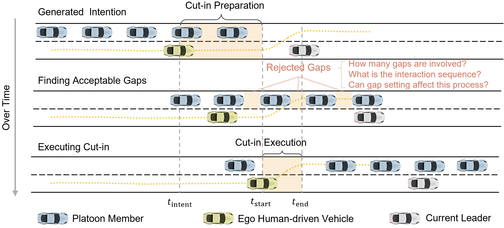
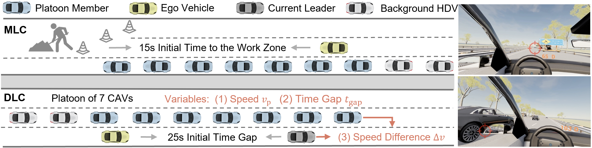
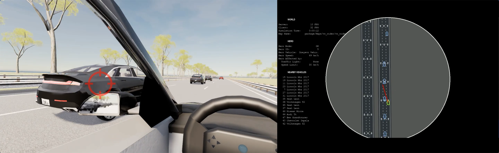
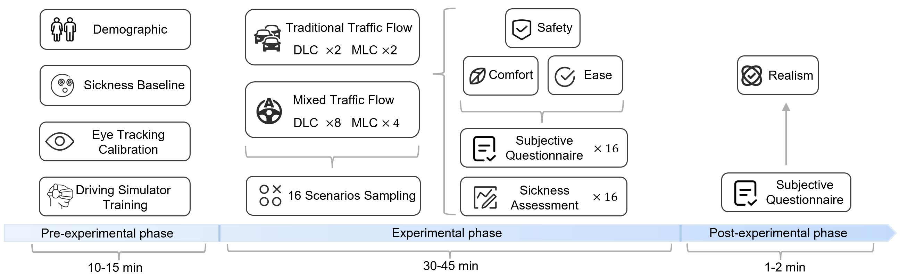

# Scenario 1: HDV Cuts into a CAV Platoon

### 📹 Experiment Demonstration Video

**Full Experimental Session Walkthrough** (Scenario 1): [Watch on YouTube](https://youtu.be/AMHIoUTdG9g) 

*A complete demonstration video showing the VR driving experiment setup, participant instructions, and example trials from this scenario.*

---

## Scenario Description

This scenario captures HDV driver behavior when attempting to cut into a CAV platoon traveling in an adjacent lane. The experiment examines multi-gap selection decisions, where drivers may accept or reject multiple gaps before completing (or abandoning) the lane-change maneuver. The experiment systematically varies platoon cruising parameters and lane-change motivations to understand their effects on driver behavior.


*Figure: Experimental scenario setup showing HDV interacting with CAV platoon*

### Highway Environment

A six-lane bidirectional highway environment was constructed for the experiment:

- **Road Type**: Six-lane bidirectional highway (3 lanes per direction)
- **Lane Width**: 3.75 meters per lane
- **Traffic Direction**: Separated bidirectional traffic flow
- **Speed Limit**: Highway speed conditions (72-108 km/h)

### Traffic Configuration

Two distinct traffic configurations were designed to induce different lane-change motivations:

**Direction 1 - DLC (Discretionary Lane Change):**
- **Trigger**: A blocking slow vehicle ahead in the ego vehicle's current lane
- **Motivation Type**: Non-urgent, discretionary lane change to maintain desired speed
- **Driver Freedom**: Drivers can choose when and whether to change lanes

**Direction 2 - MLC (Mandatory Lane Change):**
- **Trigger**: Work zone ahead that closes the ego vehicle's current lane
- **Motivation Type**: Urgent, mandatory lane change required by road constraints
- **Driver Constraint**: Drivers must change lanes within a limited time window

### Vehicle Configuration

**Platoon Setup:**
- **Platoon Size**: 7 CAV members
- **Rationale**: Ensures high visibility and provides adequate cut-in opportunities for lane-changing maneuvers
- **Lane Position**: Platoon occupies the leftmost lane (fast lane)
- **Reason for Left Lane**: Platoons typically stay in the leftmost lane to minimize unnecessary lane-change disturbances, which is a common focus in existing mixed-traffic studies

**Background Traffic:**
- **Trailing Vehicles**: 2 SUMO-controlled HDVs positioned behind the platoon
- **Purpose**: To simplify the mixed traffic environment and ensure lane changes at the end of the platoon are still counted as cut-ins into the platoon

**Ego Vehicle:**
- **Type**: VR-driving enabled HDV
- **Initial Position**: Parallel to the middle of the platoon (alongside the 3rd or 4th vehicle)
- **Initial Speed**: 60% of the target platoon speed
- **Lane Restriction**: Drivers are restricted to merging only into the left lane occupied by the platoon


*Figure: Detailed traffic configuration for DLC and MLC scenarios*

## Experimental Parameters and Sub-Scenarios

Each traffic configuration (DLC and MLC) was further divided into **22 sub-scenarios** by systematically varying key parameters. These parameters control platoon cruising states, speed differences, and traffic compositions.

### Adjustable Parameters

Three primary parameters were manipulated across sub-scenarios:

#### 1. Platoon Cruising Speed ($v_p$)

Two speed levels representing different highway conditions:
- **72 km/h**: Lower highway speed condition
- **108 km/h**: Higher highway speed condition

#### 2. Desired Time Gap ($t_{gap}$)

Three time gap settings for CAV platoons:
- **0.6 seconds**: Tight spacing (approximately 12m at 72 km/h, 18m at 108 km/h)
- **0.9 seconds**: Moderate spacing (approximately 18m at 72 km/h, 27m at 108 km/h)
- **1.2 seconds**: Comfortable spacing (approximately 24m at 72 km/h, 36m at 108 km/h)

For traditional traffic comparison:
- **1.94 seconds**: Typical HDV following time gap (based on naturalistic driving data)

#### 3. Speed Difference (Δ$v$) - DLC Scenarios Only

Two levels of speed reduction by the blocking slow vehicle ahead:
- **10% deceleration**: Moderate speed difference (e.g., blocking vehicle at 64.8 km/h when platoon at 72 km/h)
- **20% deceleration**: Larger speed difference (e.g., blocking vehicle at 57.6 km/h when platoon at 72 km/h)

### Sub-Scenario Combinations

**Mixed Traffic (CAV Platoon) Sub-Scenarios:**

For **DLC**:
- 2 platoon speeds × 3 time gaps × 2 speed differences = **12 sub-scenarios**

For **MLC**:
- 2 platoon speeds × 3 time gaps × 1 work zone = **6 sub-scenarios**

**Traditional Traffic (HDV Platoon) Sub-Scenarios:**

To establish baselines for comparison, traditional traffic sub-scenarios were included, where CAVs were replaced with HDVs maintaining the same spacing. However, to prevent excessive experiment duration that could induce driver fatigue, the number of traditional traffic sub-scenarios was reduced:

- Variable Δ$v$ (unrelated to platoon cruising states) was fixed at 20%
- Only speed variations were retained

For **DLC Traditional Traffic**:
- 2 speeds × 1 time gap (1.94s) × 1 speed difference (20%) = **2 sub-scenarios**

For **MLC Traditional Traffic**:
- 2 speeds × 1 time gap (1.94s) × 1 work zone = **2 sub-scenarios**

**Total Sub-Scenarios per Traffic Configuration:**
- Mixed Traffic: 12 (DLC) + 6 (MLC) = **18 sub-scenarios**
- Traditional Traffic: 2 (DLC) + 2 (MLC) = **4 sub-scenarios**
- **Grand Total: 22 sub-scenarios**

### Summary Table of All Sub-Scenarios

Table 1 presents the complete parameter combinations for all 22 experimental sub-scenarios:

**Table 1. Parameter Combinations of Experimental Sub-Scenarios**

| Lane-Change Type | Platoon Type | Platoon Speed (km/h) | Time Gap (s) | Leading Vehicle Speed (km/h) | Scenario ID |
|------------------|--------------|----------------------|--------------|------------------------------|-------------|
| **DLC (Discretionary)** | Mixed Traffic | 72 | 0.6 | 57.6 | 0 |
| | | 72 | 0.6 | 64.8 | 1 |
| | | 72 | 0.9 | 57.6 | 2 |
| | | 72 | 0.9 | 64.8 | 3 |
| | | 72 | 1.2 | 57.6 | 4 |
| | | 72 | 1.2 | 64.8 | 5 |
| | | 108 | 0.6 | 86.4 | 6 |
| | | 108 | 0.6 | 97.2 | 7 |
| | | 108 | 0.9 | 86.4 | 8 |
| | | 108 | 0.9 | 97.2 | 9 |
| | | 108 | 1.2 | 86.4 | 10 |
| | | 108 | 1.2 | 97.2 | 11 |
| | Traditional Traffic | 72 | 1.94 | 57.6 | 12 |
| | | 108 | 1.94 | 86.4 | 13 |
| **MLC (Mandatory)** | Mixed Traffic | 72 | 0.6 | - | 0 |
| | | 72 | 0.9 | - | 1 |
| | | 72 | 1.2 | - | 2 |
| | | 108 | 0.6 | - | 3 |
| | | 108 | 0.9 | - | 4 |
| | | 108 | 1.2 | - | 5 |
| | Traditional Traffic | 72 | 1.94 | - | 6 |
| | | 108 | 1.94 | - | 7 |

*Note: Units are km/h for speeds and seconds for time gaps. "-" indicates not applicable (MLC scenarios are triggered by work zone, not leading vehicle speed).*

### Traffic Composition Conditions

- **Mixed Traffic**: Ego HDV interacting with 7-vehicle CAV platoon + 2 trailing HDVs
- **Traditional Traffic**: Ego HDV interacting with 7-vehicle HDV platoon + 2 trailing HDVs (baseline/control condition)


*Figure: Screenshot of an Experiment*

## Experimental Procedure

### Initial Conditions and Warm-up Phase

**Ego Vehicle Initial State:**
- **Position**: Parallel to the middle of the platoon (3rd or 4th vehicle position)
- **Initial Speed**: 60% of the target platoon speed $v_p$
  - Example: If $v_p$ = 72 km/h, ego vehicle starts at approximately 43 km/h
  - Example: If $v_p$ = 108 km/h, ego vehicle starts at approximately 65 km/h

**Driver Instructions:**
- Accelerate from the initial speed toward the target speed
- Freely maintain their speed within ±10% of $v_p$ (no fixed speed requirement)
- Make lane-change decisions based on their own judgment

**Warm-up Phase Duration:**

To ensure sufficient observation and decision-making time for drivers, scenario-specific warm-up phases were implemented:

- **DLC Scenarios**: 25-second warm-up phase
  - Controlled by the time gap between the ego vehicle and its current leader
  - Provides ample time for non-urgent lane-change evaluation
  
- **MLC Scenarios**: 15 seconds initial time to the work zone
  - Calculated assuming drivers maintain the expected speed
  - Creates heightened urgency to encourage timely lane changes
  - Prevents Anticipatory Lane Change (ALC), where drivers change lanes too early to avoid potential conflicts, which is not within the scope of this study

### Experimental Session Structure

The complete experimental session was divided into three phases, as illustrated in Figure X below:


*Figure X: Overview of experimental session phases and timeline*

#### Pre-Experimental Phase (10-15 minutes)

This preparatory phase ensures participant readiness and data quality:

1. **Demographic Questionnaire**:
   - Age, gender, driving experience
   - Annual mileage, familiarity with autonomous vehicles
   - Self-reported driving style

2. **Simulator Sickness Baseline (SSQ)**:
   - Pre-experiment assessment to establish baseline simulator sickness levels
   - Used to detect changes during/after the experiment

3. **Eye-Tracking Calibration**:
   - Multi-point calibration procedure
   - Validation to ensure tracking accuracy
   - Re-calibration if necessary

4. **Driving Simulator Training**:
   - Familiarization with VR driving controls (steering wheel, pedals)
   - Practice driving in scenarios **distinct from formal experimental trials**
   - Participants practice until comfortable with the simulator environment
   - Typically 3-5 practice trials

#### Experimental Phase (30-45 minutes)

To mitigate fatigue and cognitive decline, each participant was limited to **16 sub-scenarios** (rather than all 22), lasting approximately one hour in total. The scenario selection and presentation order were carefully designed:

**Scenario Sampling Strategy:**
- **Traditional Traffic Flow**: All scenarios completed first
  - DLC × 2 scenarios
  - MLC × 2 scenarios
- **Mixed Traffic Flow**: Two-thirds of available scenarios, presented in random order
  - DLC × 8 scenarios (out of 12 available)
  - MLC × 4 scenarios (out of 6 available)

**Total: 16 scenarios per participant**

**Scenario Assignment Across Participants:**

Due to the sampling strategy (each participant completed 8 out of 12 DLC mixed scenarios and 4 out of 6 MLC mixed scenarios), different participants experienced different combinations of sub-scenarios. For detailed information on which specific scenarios each of the 60 participants completed, please refer to the [trials_info/README.md](trials_info/README.md) file, which contains the complete scenario assignment matrix.

**Information Disclosure to Participants:**

Participants were informed about:
- The distinctive appearance of the CAV platoon (visual identification)
- Characteristic shorter time gaps compared to traditional traffic
- General yielding capability of the platoon

To prevent drivers from exploiting the platoon's fixed control rules, the specific yielding algorithms and decision logic were deliberately withheld.

**Data Collection During Experimental Phase:**
- **After each trial**: Subjective Questionnaire (Safety, Comfort, Ease) × 16
- **Every 4-5 trials**: Simulator Sickness Assessment × 3-4 times
- Continuous recording of vehicle trajectories, eye-tracking, and control inputs

**Quality Control Measures:**
- Continuous monitoring for simulator sickness symptoms
- Mandatory rest breaks between trial blocks (every 5-7 trials)
- Option to pause or terminate if participant experiences discomfort
- Data validity checks after each trial

#### Post-Experimental Phase (1-2 minutes)

Final assessments to capture overall experience:

1. **Overall Subjective Questionnaire**:
   - Van Der Laan Acceptance Scale: Overall acceptance of interacting with platoons
   - General feedback on the experimental experience

2. **Realism Assessment**:
   - Perceived realism of the driving simulation
   - Realism of traffic scenarios and platoon behavior

3. **Final Simulator Sickness Questionnaire (SSQ)**:
   - Post-experiment assessment to detect any induced simulator sickness

**Session Structure Summary:**
- **Total Duration**: Approximately 45-65 minutes per participant
- **Number of Scenarios**: 16 sub-scenarios (4 traditional traffic + 12 mixed traffic)
- **Counterbalancing**: Mixed traffic scenarios randomized across participants using Latin square design
- **Data Collected**: ~16 trials × 60 participants = ~960 valid trials total

## Data Collected

This scenario captures multiple data streams synchronized to provide comprehensive behavioral insights:

### Vehicle Dynamics Data

**Ego Vehicle (HDV driven by participant):**
- Position, velocity, acceleration (10Hz sampling rate)
- Steering angle, throttle, brake inputs
- Lane position and heading angle
- Turn signal activation timing

**Platoon Vehicles (CAVs):**
- Position, velocity, acceleration for all 4 platoon members
- Inter-vehicle spacing within platoon
- Platoon control status

**Surrounding Traffic:**
- Trajectories of all nearby vehicles
- Relative positions to ego vehicle


### Eye-Tracking Data

- **Gaze Direction**: 3D gaze vectors at 90Hz
- **Fixation Events**: Location and duration of visual fixations
- **Saccade Patterns**: Rapid eye movements between fixations  
- **Areas of Interest (AOI)**: Gaze time on mirrors, platoon vehicles, instrument cluster, etc.
- **Pupil Diameter**: Cognitive load indicator

### Behavioral Events

Automatically detected and manually verified:
- **Lane-Change Initiation**: Moment when lateral movement begins
- **Gap Rejection**: When driver evaluates a gap but chooses not to merge
- **Gap Acceptance**: When driver commits to merge into a specific gap
- **Cut-in Types**: Classified as front cut-in, parallel cut-in, or back cut-in
- **Maneuver Completion**: Successful lane change completion or abandonment

### Subjective Assessment

**Post-Trial Questionnaire (After each trial):**
- Safety perception: "How safe did you feel during the lane change?" (5-point scale)
- Comfort perception: "How comfortable was the lane change maneuver?" (5-point scale)
- Ease perception: "How easy was it to find an appropriate gap?" (5-point scale)

**Session-Level Assessments:**
- Simulator Sickness Questionnaire (SSQ): Administered before and after session
- Van Der Laan Acceptance Scale: Overall acceptance of interacting with platoons
- Driving behavior questionnaire: Self-reported driving style

## Dataset Structure for This Scenario

```
scenario1-HDV cuts into a CAV Platoon/
├── brief_introduction.md            # This file
├── carla_package/                   # Simulation configuration files
│   ├── README.md
│   ├── download_link.md
│   ├── maps/                        # Road network definitions
│   ├── vehicle_configs/             # Vehicle parameters
│   └── platoon_controllers/         # CAV control algorithms
├── questionnaires/                  # Subjective assessment data
│   ├── README.md
│   ├── download_link.md
│   ├── demographics.csv             # Participant information
│   ├── post_trial_PEQ.csv          # Per-trial perception ratings
│   ├── SSQ_pre_post.csv            # Simulator sickness data
│   └── acceptance_scale.csv        # Van Der Laan acceptance ratings
├── run_artifacts/                   # Raw behavioral data
│   ├── README.md
│   ├── download_link.md
│   ├── participant_001/
│   │   ├── trial_001_trajectories.csv
│   │   ├── trial_001_gaze.csv
│   │   ├── trial_001_events.json
│   │   └── ...
│   └── ...
├── trials_info/                     # Experimental design metadata
│   ├── README.md
│   ├── scenario_parameters.csv      # All condition combinations
│   ├── trial_assignment.csv         # Which participant did which trial
│   └── randomization_scheme.csv     # Counterbalancing information
└── videos/                          # Video recordings
    ├── README.md
    ├── download_link.md
    ├── participant_001/
    │   ├── trial_001_driver_view.mp4
    │   ├── trial_001_birds_eye.mp4
    │   └── ...
    └── ...
```
## Example Use Cases

This scenario's data is particularly useful for:

1. **Gap Acceptance Modeling**: Analyzing which gaps drivers choose under varying platoon parameters
2. **Multi-Stage Decision Modeling**: Understanding sequential gap evaluation and rejection patterns
3. **Intention Prediction**: Training ML models to predict lane-change intentions from gaze and vehicle control
4. **Urgency Effects**: Comparing discretionary vs. mandatory lane-change behaviors
5. **Platoon Parameter Optimization**: Identifying configurations that balance cut-in management with traffic flow

## Data Access

For downloading data from this scenario:
- [CARLA Configuration Files](carla_package/download_link.md)
- [Questionnaire Data](questionnaires/download_link.md)
- [Behavioral Data (run_artifacts)](run_artifacts/download_link.md)
- [Video Recordings](videos/download_link.md)

## Related Publication

Analysis of this scenario data is published in:

**IEEE Transactions on Intelligent Transportation Systems**  
Liu, B., Li, M., Zhu, F., Yang, S., & Li, Z. (2026). [Paper title]

For citation information and other dataset details, see the [main README](../README.md).
